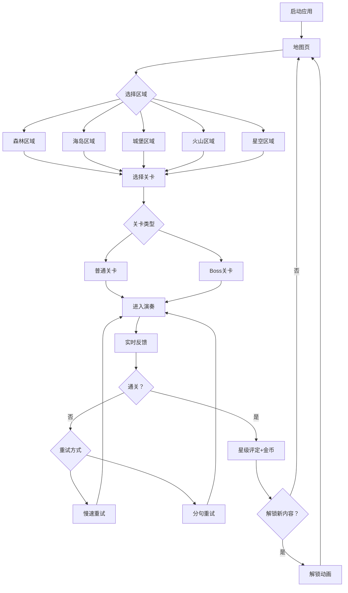

## 1. 产品概述

视奏大冒险是一款面向 6-12 岁儿童的平板端单机视奏陪练游戏产品。通过将枯燥的视奏练习拆解为森林、海岛、城堡等主题闯关，让孩子在游戏化体验中完成实时纠错与能力提升，激发练习意愿，适合容易厌烦传统陪练的孩子。

- 目标用户：6-12 岁正在学习钢琴/键盘乐器的儿童，以及关注练习质量的家长
- 核心价值：用闯关替代打分，用角色养成替代成绩单，让孩子"想练"而不是"被逼练"

## 2. 核心功能

### 2.1 用户角色

| 角色 | 进入方式 | 核心权限 |
|------|----------|----------|
| 小冒险家（儿童） | 自由进入 | 闯关、角色养成、商店兑换、查看成长图鉴 |
| 守护者（家长） | 密码/PIN 进入 | 设置每日游戏时长、关卡难度、查看能力地图 |

### 2.2 功能模块

1. **地图页**：主题世界地图，展示森林、海岛、城堡等区域，可点选关卡
2. **关卡页**：视奏演奏界面，含乐谱显示、实时反馈、角色前进动画
3. **角色养成页**：查看与更换角色服装、徽章、乐器皮肤
4. **宝箱商店页**：用闯关获得的金币兑换装饰道具
5. **成长图鉴页**：已掌握的节奏型、调号记录，能力地图查看
6. **家长中心**：时长限制、难度调节、能力地图报告
7. **双人接力页**：两个设备/同一设备分屏，一人读谱一人打拍

### 2.3 页面详情

| 页面名称 | 模块名称 | 功能描述 |
|----------|----------|----------|
| 地图页 | 世界地图 | 展示森林、海岛、城堡、火山、星空五大主题区域，每个区域含 6-8 个普通关 + 1 个 Boss 关 |
| 地图页 | 区域选择 | 点击区域展开关卡列表，已通关显示星级，未解锁显示锁定状态 |
| 地图页 | 角色漫游 | 角色在地图上行走至当前关卡位置的动画 |
| 关卡页 | 乐谱显示 | 展示当前小节乐谱，高亮当前演奏位置 |
| 关卡页 | 节拍指示器 | 环形/条形节拍进度，实时显示当前拍位，跟上是绿色、落后变橙色、严重偏离变红色 |
| 关卡页 | 角色前进 | 演奏正确时角色沿轨道前进，错音/停顿触发小障碍（踩泥坑/被藤蔓缠住等） |
| 关卡页 | 失败重试 | 失败后弹出"慢速重试"和"分句重试"两个选项 |
| 关卡页 | 通关结算 | 显示星级评定、获得金币、解锁奖励动画 |
| 角色养成页 | 角色展示 | 3D/Q版角色展示，可旋转查看 |
| 角色养成页 | 装备更换 | 服装、徽章、乐器皮肤切换预览 |
| 宝箱商店页 | 商品列表 | 分类展示可兑换道具，含价格和预览 |
| 宝箱商店页 | 金币余额 | 显示当前金币数量和最近获得记录 |
| 成长图鉴页 | 技能图谱 | 可视化展示已掌握的节奏型和调号，点击可回顾 |
| 成长图鉴页 | 能力地图 | 每周生成一张雷达图，标注进步最明显和最容易失误的能力 |
| 家长中心 | 时长限制 | 设置每日游戏时长上限，到时自动提醒 |
| 家长中心 | 难度调节 | 可锁定当前最高难度等级 |
| 家长中心 | 报告查看 | 查看孩子每周能力地图和练习数据 |
| 双人接力页 | 分屏界面 | 上半屏读谱、下半屏打拍，接力完成后互换角色 |
| 双人接力页 | 配合反馈 | 实时显示两人配合的节奏匹配度 |

## 3. 核心流程

### 3.1 闯关流程

用户打开应用 → 进入地图页 → 选择区域 → 选择关卡 → 进入关卡页 → 乐谱加载 → 节拍器倒计时开始 → 用户演奏 → 实时反馈（正确前进/错误阻碍）→ 演奏结束 → 通关判定 → 星级评定与金币奖励 → 解锁检查（服装/徽章/新关卡）→ 返回地图

### 3.2 流程图

### 3.3 角色养成流程

通关获得金币 → 进入宝箱商店 → 选择道具 → 金币兑换 → 装备至角色 → 在关卡和地图中展示新外观

## 4. 用户界面设计

### 4.1 设计风格

- **主色调**：温暖橘色（#FF8C42）为活力色，森林绿（#4CAF50）为自然色，天空蓝（#64B5F6）为辅助色
- **辅助色**：暖黄（#FFD54F）用于金币/奖励，珊瑚红（#FF6B6B）用于警告/错误
- **背景色**：奶油白（#FFF8E7）+ 浅米色渐变
- **按钮风格**：圆角大按钮，3D 立体感（底部阴影+渐变），按压有弹性动画
- **字体**：标题使用圆润可爱的展示字体（如 Fredoka One / Baloo 2），正文使用清晰可读的 Nunito
- **布局风格**：底部导航栏切换五大模块，卡片式内容区域，圆角插画风格
- **图标/插画风格**：扁平+微立体（Flat 2.0），可爱卡通风格，每区域有独特主题色

### 4.2 页面设计概览

| 页面名称 | 模块名称 | UI 元素 |
|----------|----------|---------|
| 地图页 | 世界地图 | 竖向滚动地图，手绘风格背景，每个区域用不同色块区分，角色沿路径走动的 CSS 动画，区域入口用圆形按钮+区域图标 |
| 地图页 | 关卡列表 | 横向滚动卡片，每个关卡一张卡片，显示关卡名、技能标签、星级，锁定关卡灰色+锁图标 |
| 关卡页 | 乐谱显示 | 五线谱白色面板居中，当前小节高亮，滚动式乐谱从右向左移动，节拍位置用小光标标记 |
| 关卡页 | 节拍指示器 | 底部环形进度条，中心显示拍数，颜色渐变（绿→橙→红），配合脉冲动画 |
| 关卡页 | 角色轨道 | 乐谱下方横向轨道，角色小人沿轨道前进，错误时触发对应主题的小障碍动画 |
| 关卡页 | 失败重试弹窗 | 半透明遮罩+圆角弹窗卡片，两个大按钮"🐢 慢速重试"和"✂️ 分句重试" |
| 角色养成页 | 角色展示 | 中央大号角色卡，可左右滑动切换角色姿态，底部 Tab 切换服装/徽章/乐器皮肤 |
| 角色养成页 | 装备切换 | 网格排列的道具卡片，选中高亮边框，点击预览效果 |
| 宝箱商店页 | 商品列表 | 顶部金币余额栏，下方分 Tab 展示服装/徽章/乐器，卡片含预览图+价格+兑换按钮 |
| 成长图鉴页 | 技能图谱 | 网格式展示已掌握技能，每格一个节奏型/调号，已掌握亮色+勾，未掌握灰色 |
| 成长图鉴页 | 能力地图 | 五角雷达图，标注五项能力（稳拍/识谱/跳进/左右手/连贯），最强项高亮绿色，最弱项标注提示 |
| 家长中心 | 设置面板 | 简洁表单风格，滑块调时长，下拉选难度，底部"保存"按钮 |
| 双人接力页 | 分屏界面 | 上下等分屏幕，上半屏"读谱手"蓝色主题，下半屏"打拍手"绿色主题，中间连接动画 |

### 4.3 响应式设计

- 以平板端（768px-1366px）为优先设计尺寸
- 横屏为主，竖屏自适应布局
- 所有按钮尺寸 ≥ 48px，适合儿童触控操作
- 文字大小 ≥ 16px，确保儿童可读

### 4.4 交互动效

- 关卡进入：地图缩小+关卡场景展开的转场动画
- 正确演奏：角色弹跳前进 + 星光粒子特效
- 错误演奏：角色轻微摇晃 + 对应主题障碍动画（森林=藤蔓、海岛=浪花、城堡=落石）
- 通关庆祝：烟花粒子 + 星级弹出动画 + 金币飞入钱包动画
- 解锁新内容：宝箱打开动画 + 光芒四射
- 地图页角色行走：帧动画循环
