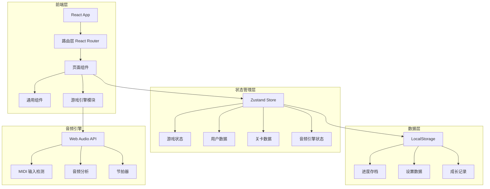
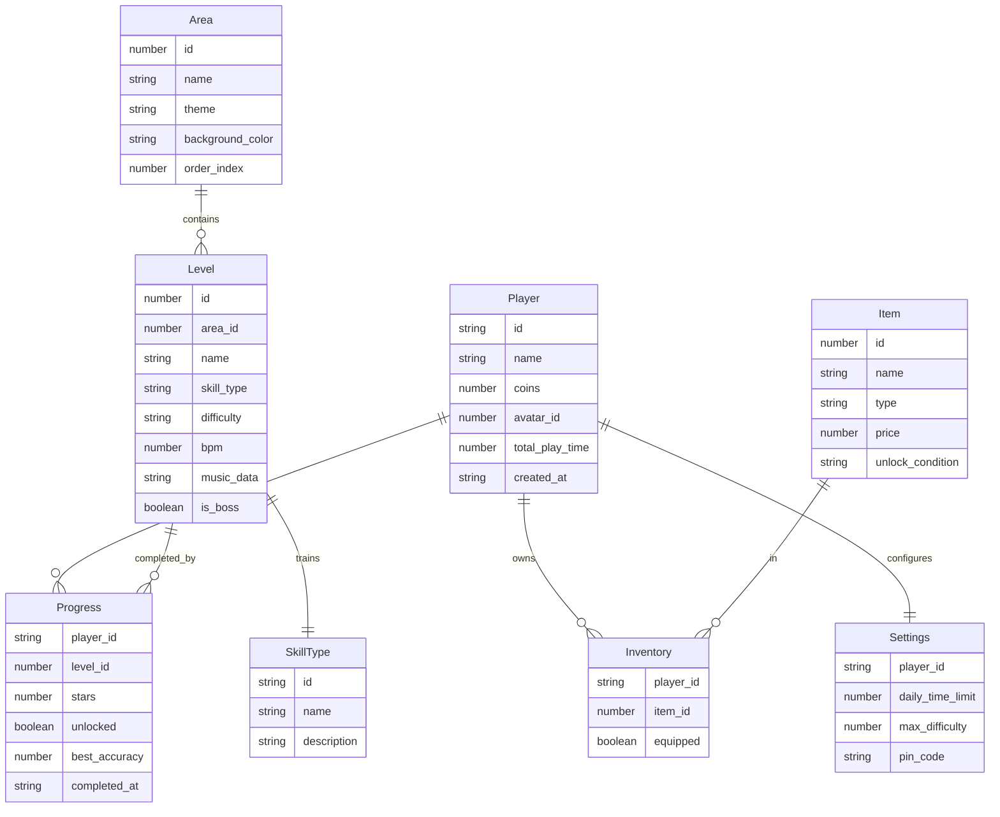

## 1. 架构设计



## 2. 技术说明

- **前端框架**：React 18 + TypeScript + Vite
- **样式方案**：Tailwind CSS 3 + 自定义主题
- **状态管理**：Zustand（轻量、适合单机应用）
- **路由**：React Router DOM 6
- **音频处理**：Web Audio API + MIDI Web API（检测键盘/MIDI 输入）
- **动画**：Framer Motion（页面转场+交互动效）+ CSS Animations（角色帧动画）
- **数据持久化**：LocalStorage（单机无需后端）
- **图标**：Lucide React
- **初始化工具**：Vite Init

## 3. 路由定义

| 路由 | 用途 |
|------|------|
| `/` | 启动欢迎页，角色选择/加载存档 |
| `/map` | 世界地图页，五大主题区域展示 |
| `/level/:id` | 关卡页，视奏演奏主界面 |
| `/character` | 角色养成页，服装/徽章/乐器皮肤管理 |
| `/shop` | 宝箱商店页，金币兑换道具 |
| `/collection` | 成长图鉴页，技能图谱+能力地图 |
| `/parent` | 家长中心，时长/难度设置 |
| `/duo` | 双人接力模式页 |

## 4. 数据模型

### 4.1 数据模型定义



### 4.2 数据定义

使用 LocalStorage 存储 JSON 格式数据，键名设计：

- `sightread_player`：玩家基本信息与金币
- `sightread_progress`：关卡进度（按 area_id + level_id 索引）
- `sightread_inventory`：已拥有道具及装备状态
- `sightread_settings`：家长设置
- `sightread_weekly_report`：每周能力地图数据

### 4.3 关卡音乐数据结构

每个关卡的音乐数据用 JSON 表示：

```typescript
interface LevelMusicData {
  bpm: number;
  timeSignature: [number, number];
  measures: Measure[];
}

interface Measure {
  notes: Note[];
}

interface Note {
  pitch: string;
  duration: number;
  hand: 'left' | 'right';
  beatPosition: number;
}

interface SkillType {
  id: 'steady_beat' | 'sight_read' | 'interval_jump' | 'hand_switch' | 'continuous';
  name: string;
  description: string;
}
```

## 5. 核心模块设计

### 5.1 音频引擎模块

- **MIDI 输入检测**：监听 Web MIDI API 事件，检测键盘按键映射到对应音高
- **音高匹配**：将用户演奏的音高与当前乐谱期望音高做实时比对
- **节拍追踪**：根据 BPM 计算当前拍位，判断用户输入是否在正确时间窗口内
- **节拍器**：使用 Web Audio API OscillatorNode 生成节拍器声音

### 5.2 关卡逻辑模块

- **能力映射**：每种关卡类型对应一种训练技能
  - 稳拍（steady_beat）：固定节奏型重复
  - 识谱（sight_read）：辨识不同音高
  - 跳进（interval_jump）：音程跳跃练习
  - 左右手切换（hand_switch）：双手交替练习
  - 连贯（continuous）：Boss 关综合考查
- **实时反馈计算**：正确率 = 正确音符数 / 总音符数，节奏偏差 = 实际拍位 - 期望拍位
- **星级评定**：3 星 ≥ 90%，2 星 ≥ 70%，1 星 ≥ 50%，< 50% 未通过
- **失败重试**：慢速重试 BPM 降至 70%，分句重试将乐谱拆分为 2-4 小节段落

### 5.3 角色养成模块

- **解锁条件**：连续通关指定数量关卡解锁对应服装/徽章/乐器皮肤
- **金币经济**：每颗星 = 10 金币，Boss 关 = 50 金币额外奖励
- **装备展示**：角色在不同页面展示当前装备外观

### 5.4 家长控制模块

- **时长监控**：每次进入关卡记录开始时间，累计当日时长，达到限制弹出提醒
- **难度锁定**：根据设置限制可选关卡的最大 BPM 和音符密度
- **PIN 验证**：进入家长中心需输入 4 位数字 PIN

### 5.5 双人接力模块

- **设备内分屏**：上下分屏，一人负责读谱（点击正确音符名），一人负责打拍（点击节拍按钮）
- **配合评分**：读谱准确率 × 节拍稳定度 = 综合评分
- **角色互换**：每完成一段后自动互换角色

### 5.6 能力地图生成

- **数据采集**：记录每次演奏的正确率、节奏偏差、错误类型分布
- **五维雷达图**：稳拍、识谱、跳进、左右手、连贯
- **周报生成**：每周一自动汇总上周数据，标注进步项和薄弱项
